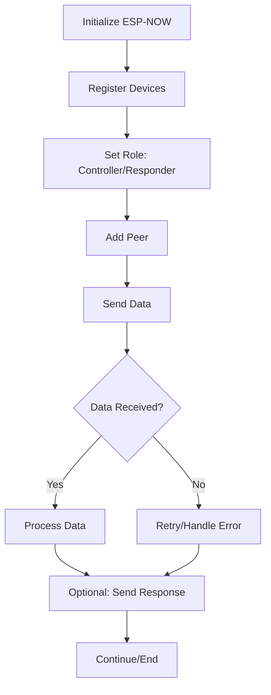

# ESP-NOW 

ESP-NOW is a fast, low-power, peer-to-peer wireless communication protocol by Espressif for ESP32 and ESP8266 devices, allowing direct data exchange without Wi-Fi or Bluetooth connections.

## Flow 

## ESP-NOW Testing Code

1. [21/06/2025 & 22/06/2025](./test_21-06-2025/21-06-25.md)
2. [Long Range Testing](./ESP-NOW_LR/ESP-NOW_LR.md)
