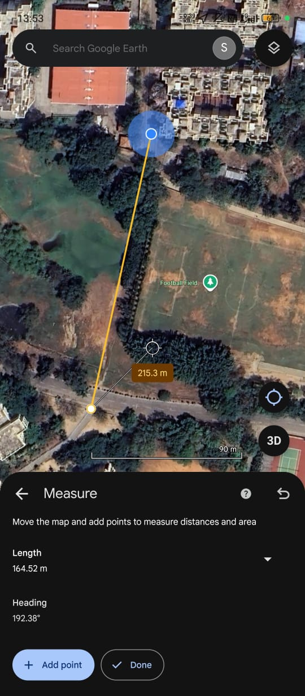
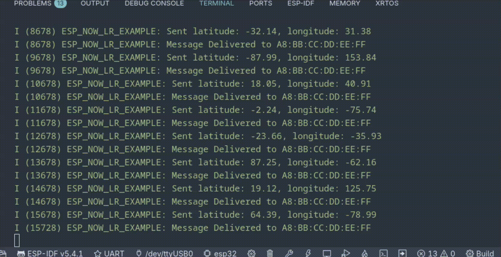
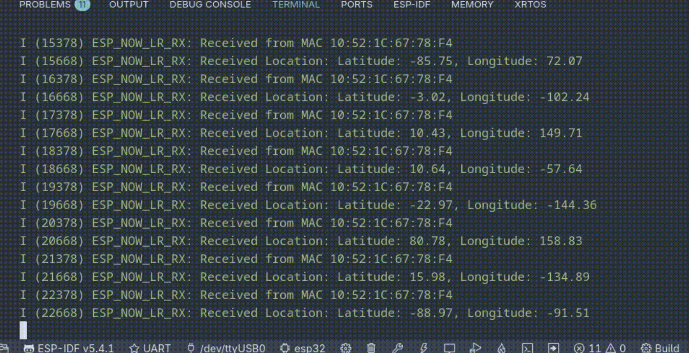

# Long Range Mode Test

## Equipment 

### Hardware 

1. ESP-32 WROOM-DA Module x 2

### Software 

1. ESP-IDF
2. Google Earth

## Outputs 

### Range 

**With Line of Sight**: 150m

**Without Line of Sight**: 94m

### Images

  

#### Transmitter Logs 

  

#### Receiver Logs 

